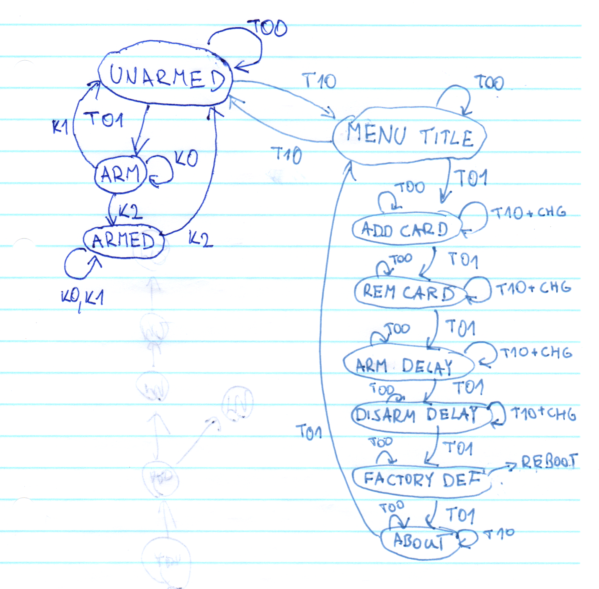

# GSS Protecc

## Specifikace zadání
*GSS Protecc*

Protecc je velice levný a jednoduchý zabezpečovací systém. 

Systém sestává z:
1. Hlavního řídícího modulu, který se obsluhuje tlačítky a s uživatelem
interaguje pomocí LCD, RGB nasvícením a tónovou odezvou.
2. Přesného PIR senzoru s nastavitelnou citlivostí.
3. Velmi hlasité sirény.
4. Čtečky RFID tagů (či karet).

Systém má intuitivní rozhraní.
Po nastavení stačí systém zablokovat a již hlídá vymezené území.
Odblokace probíhá pouhým přiložením povoleného tagu.
Pomocí master tagu lze pak měnit nastavení
a především přídávat či odebírat tagy, které mají přístup.

## Teoretická příprava
### Úvod
Na začátku bylo třeba rozmyslet strukturu celého projektu. Nabízelo se několik možností.
První, z hlediska estetiky kódu, portability a univerzálnosti nejlepší možností se nabízelo vytvořit knihovnu pro správu menu pro Arduino. Jelikož je však Arduino stále jen mikrokontrolér, rozhodl jsem se tuto možnost nevyužít, jelikož by z principu funkce vyžadovala dynamickou alokaci paměti, což v zařízeních s takto omezenými prostředky není vhodná volba. Na stejném "problému" ztroskotává i vestavěný typ Arduino knihovny `String`, který sic nabízí líbívé rozhraní podobně jako STL `std::string` či JavaScript `string`, ale z hlediska paměti je nenasytný (o čemž jsem se sám pokusně přesvědčil při raných pokusech s Arduinem na základní škole).

Druhou, poněkud méně univerzální, ale stále relativně přehlednou možností, je popsání celé aplikace pomocí konečného automatu. Jelikož stavů nebude příliš (zabezpečeno, nezabezpečeno, položky menu), je tato možnost vhodná.

Poslední, naivní implementací, je prosté volání funkcí a využití blokujícího čekání `delay`. Tato možnost je však vhodná možná pro seznámení s Arduinem, ve větších aplikacích znesnadňuje rozšiřitelnost.

Po zvážení a zkusmé implementaci jsem se rozhodl pro možnost druhou, kdy mohu zároveň uplatnit znalosti nabyté v předmětu BI-SAP v praxi. Jsou však výjimky (čtení RFID), kdy jsem se rozhodl pro aplikaci poslední možnosti - blokující čekání na čtečku. Kdyby čtení bylo neblokující, muselo by se pro každé čtení (ať už při odblokování či přidávání karet) přidat další stav, takhle by se rychle automat stal nepřehledným. Navíc tato možnost nic neomezuje, jelikož během čtení není třeba provádět žádné další úkony.

### Vhodná praxe
Jak bylo zmíněno v předchozích odstavcích, v mikrokontrolérech je paměť drahá. Proto také dodržuji jednochou zásadu, používat co nejmenší datové typy. Čili tam, kde je potřeba uložit hodnoty z malé množiny, stačí `uint8_t` (v Arduino ekosystému označováno `byte`). Kde je třeba uložit statický text, stačí `const char*` místo `String`.

### Upřesnění funkcionality
Zařízení bude kromě hlavní funkce hlídání území (režimy zablokováno, odblokováno) obsahovat rozhraní pro jednoduchou konfiguraci:
- přidání tagu,
- smazání tagu,
- prodleva při zablokování,
- prodleva při odblokování,
- výchozí nastavení,
- informace o zařízení.

### Návrh automatu (STG)
Tlačítka jsou označeny jako TXY, kdy X je levé, Y pravé tlačítko. Čtečka je označena jako K, kde 0 je žádná karta, 1 neznámá a 2 známá karta.

### Použitý hardware
- Arduino Uno,
- RFID-RC522,
- 16x2 I2C LCD,
- RGB led,
- mikrospínače,
- piezzo pasivní bzučák,
- PIR,
- siréna.

### Použité knihovny
- standardní knihovna Arduino,
- Wire,
- LiquidCrystal I2C,
- SPI,
- MFRC522,
- EEPROM.

### Použité algoritmy
Algoritmy se uplatní hlavně při práci s pamětí EEPROM. Jelikož je však kapacita záznamů omezena na jednotky, maximálně desítky a vyhledávání a ukládání neprobíhá často, stačí naivní implementace se složitostí O(n).

### Použité datové struktury
Z datových struktur převládá klasické pole, což souvisí s tím, že například není potřeba často vyhledávat a používat kvůli tomu sofistikovanější struktury.

Pro reprezentaci stavů automatu jsem zvolil `enum`, aby byla kompilátorem automaticky kontrolována validita.

### Toolchain
Rozhodl jsem se pro využití alternativy k oficiálnímu Arduino IDE, tedy Platformio IDE ve formě rozšíření pro Visual Studio Code. Tato alternativa nabízí pohodlnější správu knihoven, modularizaci projektu a svou povahou i profesionálnější editor.

Pro velice jednoduché verzování v rané fázi jsem využil OneDrive, pro další fáze projektu plánuji využít git.