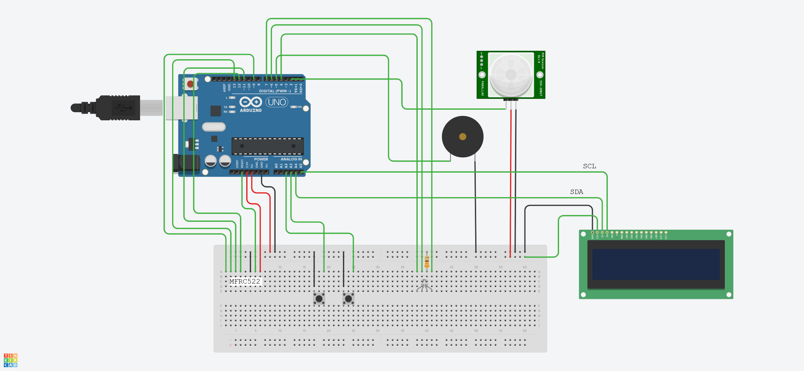

# Dokumentace projektu

## Použité součástky
- Arduino Uno,
- generický PIR senzor,
- pasivní piezzo,
- LCD 16×2 s I2C,
- RGB LED se společnou katodou,
- dva mikrospínače,
- MFRC522,
- generická 5V siréna.

## Zapojení prototypu
Následující schéma bylo vytvořeno v on-line CAD systému TinkerCAD.
Výstupy MFRC522 jsou vyvedeny na breadboard vlevo:

`SDA | SCK | MOSI | MISO | IRQ | GND | RST | 3.3V`

Výstup IRQ není připojen.

Zapojení displeje je z důvodu absence I2C řadiče orientační a je v obrázku přeznačeno.
Do GPIO 3 pak lze připojit vstupní signál libovolné 5V sirény.



## Schéma projektu
Kód je rozdělen do dvou složek:
```
|
|- src
|   |- globals.cpp - definice globálních proměnných
|   |- main.cpp - hlavní kód
|   |- RFID.cpp - kód pro obsluhu RFID
|   |- screens.cpp - obrazovky titulní a menu
|   |- utilities.cpp - pomocné funkce
|- include
    |- constants.hpp - konstanty
    |- globals.hpp - deklarace globálních proměnných
    |- RFID.hpp - deklarace RFID funkcí
    |- screens.hpp - deklarace obrazovek
    |- types.hpp - definice uživatelských typů
    |- utilities.hpp - deklarace pomocných funkcí
```

## Popis funkce
Program je řízen konečným automatem. Jednotlivé stavy jsou reprezentovány obrazovkami, které mají dva stavy - nastavení a cyklus, podobně jako hlavní kód Arduina. Mezi těmito dvěma stavy se rozlišuje dle obsahu proměnné setupScreen (true/false).

Některé obrazovky obsahují i podobrazovky, např. pro načítání karty. Stav podobrazovky je zachycen pomocí proměnné typu `static`.

Všechny pomocné funkce jsou neblokující, proto například pro načtení stavu je nutné je volat v cyklu. To však přináší tu výhodu, že lze provádět více činností.

Podrobnější informace jsou obsaženy v hlavičkových souborech (shrnutí) a detaily implementace pak v implementačních souborech.