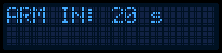
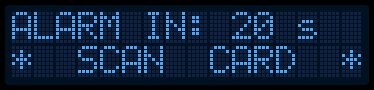
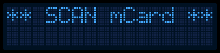

# Uživatelský manuál

Vážený zákazníku, děkujeme za zakoupení produktu GSS Protecc. Následující řádky Vás provedou nastavením a obsluhou systému.

## Popis systému
Na každé obrazovce, kde je možná interakce, je na spodním řádku vypsána nápověda buď ve tvaru akce pro tlačítka: `<LEVE> <PRAVE>`, nebo akce pro čtečku: `*SCAN CARD*` či `SCAN CARD`.

Dále systém obsahuje čtečku karet označenou ikonou antény, reproduktor pro signalizaci stavu systému, LCD a LED, která dokresluje interakci.

LED signalizuje stav těmito barvami:
- modrá: čeká se na sken karty / načítá se,
- zelená: nezabezpečeno,
- červená: zabezpečeno / čištění do továrního nastavení.

## Příslušenství
Se systémem je možné využívat libovolnou sirénu s 5V vstupem, libovolný PIR s aktivním 5V výstupem a jakoukoliv kartu kompatibilní s MIFARE Classic.

## První start
Při prvním startu je nutno nastavit hlavní kartu, kterou je možno vstupovat do menu a nastavovat systém, také nazývána jako master karta (master card). Stačí přiložit zvolenou kartu ke čtečce.

## Titulní obrazovka
Titulní obrazovka zobrazuje aktuální stav. Stav je uložen v paměti a je buď nezabezpečeno (`UNARMED`), nebo zabezpečeno (`ARMED`).

### Režim nezabezpečeno
Levé tlačítko: vstup do menu

Pravé tlačítko: zabezpečit

Stand-by režim:

Zabezpečování:

### Režim zabezpečeno
Při zjištění pohybu pomocí senzoru dojde ke spuštění odpočtu, během kterého lze odjistit bez spuštění sirény. Poté se siréna spustí.

Naskenování karty: odbezpečení

Naskenování jiné karty: návrat na titulní stránku

Před detekcí pohybu:

Po detekci pohybu:

## Menu
### Autentizace
Před vstupem do menu je nutné se autentizovat pomocí master karty.

Naskenování master karty: vstup do menu

Naskenování jiné karty: návrat na titulní stránku

### Titulní strana
Levé tlačítko: návrat na titulní stranu

Pravé tlačítko: další položka menu

### Vložení nové karty
Levé tlačítko: spuštění skenování. Po spuštění je možno kartu naskenovat, nebo stiskem libovolného tlačítka akci ukončit. Případná chyba se poté vypíše na displej.

Pravé tlačítko: další položka menu

### Smazání karty
Lze smazat libovolnou kartu kromě master. Tu lze smazat pouze továrním nastavením.

Levé tlačítko: spuštění skenování. Po spuštění je možno kartu naskenovat, nebo stiskem libovolného tlačítka akci ukončit.

Pravé tlačítko: další položka menu

### Prohlížení karet v databázi
Pomocí této funkce lze prohlížet jednotlivé identifikátory naskenovaných karet. Zobrazí se vždy pořadové číslo (začíná se od #0, kdy pořadové číslo 0 má vždy master karta) a čtyřmístné ID v hexadecimálním formátu.

Levé tlačítko: listování v kartách

Pravé tlačítko: další položka menu

Před listováním:

Během listování:

### Zjištění ID libovolné karty
Zařízení nabízí i možnost zjištění identifikátoru libovolné kompatibilní karty.

Levé tlačítko: bez funkce

Pravé tlačítko: další položka menu

Naskenování karty: zobrazení ID dané karty

Před naskenováním:

Po naskenování:

### Nastavení prodlevy před zabezpečením či před spuštěním sirény
Pro zajištění komfortu před zabezpečením a před spuštěním sirény je možno vybrat prodlevu z následujících hodnot, které jsou v sekundách:
- 10 (výchozí), 
- 20, 
- 30, 
- 60, 
- 90, 
- 180.

Levé tlačítko: listování v hodnotách

Pravé tlačítko: další položka menu

### Tovární nastavení
Při návratu do továrního nastavení se vymažou karty z databáze a hodnoty prodlev se nastaví na výchozích 10 sekund.

### Stav paměti
Tato obrazovka umožňuje zjistit stav paměti. Levá hodnota označuje zabrané pozice, pravá hodnota označuje celkový počet pozic. Pozor: do stavu paměti se počítá i master karta.

Levé tlačítko: bez funkce

Pravé tlačítko: další položka menu

### O systému
Zobrazení modelu a verze.

Levé tlačítko: bez funkce

Pravé tlačítko: další položka menu

## Řešení chyb
>Systém hlásí `MEM FAIL`. 

*Jedná se o chybu paměti. Nutný servis.*

>Systém hlásí `MEM FULL`.

*Paměť je plná. Odstraňte některé karty.*

>Systém hlásí `DUPLICATE`.

*Karta již v databázi existuje.*

>Systém hlásí `CARD NOT FOUND`.

*Karta nebyla nalezena v databázi.*

>Systém hlásí `ACCESS DENIED`.

*Karta není v databázi, nebo nemá dostatečná oprávnění (pro vstup do menu je potřebná master karta).*

